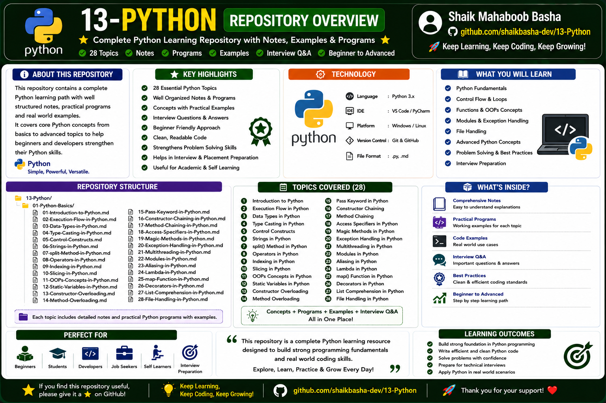

# Python

## Overview

This repository contains comprehensive notes, practical programs, examples, method references, and interview preparation materials covering fundamental and advanced concepts of **Python Programming**.

The repository is designed with a structured learning path that helps beginners build strong Python programming fundamentals while also supporting technical interview preparation, placement preparation, problem-solving, and real-world software development learning.

The content is organized into **28 essential Python topics**, progressing from Python fundamentals to object-oriented programming, exception handling, multithreading, modules, functional programming concepts, decorators, list comprehension, and file handling.

The repository covers:

* Introduction to Python
* Python Execution Flow
* Data Types
* Type Casting
* Control Constructs
* Strings
* `split()` Method
* Operators
* Indexing
* Slicing
* Object-Oriented Programming
* Static Variables
* Constructor Overloading
* Method Overloading
* `pass` Keyword
* Constructor Chaining
* Method Chaining
* Access Specifiers
* Magic Methods
* Exception Handling
* Multithreading
* Modules
* Aliasing
* Lambda
* `map()` Function
* Decorators
* List Comprehension
* File Handling

Each topic contains structured notes, practical programs, syntax, examples, explanations, important concepts, and interview-oriented content to provide a complete Python learning experience.

## Repository Overview



## Repository Structure

```text
13-Python/
│
├── 01-Python-Basics/
│   ├── 01-Introduction-to-Python.md
│   ├── 02-Execution-Flow-in-Python.md
│   ├── 03-Data-Types-in-Python.md
│   ├── 04-Type-Casting-in-Python.md
│   ├── 05-Control-Constructs.md
│   ├── 06-Strings-in-Python.md
│   ├── 07-split-Method-in-Python.md
│   ├── 08-Operators-in-Python.md
│   ├── 09-Indexing-in-Python.md
│   ├── 10-Slicing-in-Python.md
│   ├── 11-OOPs-Concepts-in-Python.md
│   ├── 12-Static-Variables-in-Python.md
│   ├── 13-Constructor-Overloading.md
│   ├── 14-Method-Overloading.md
│   ├── 15-Pass-Keyword-in-Python.md
│   ├── 16-Constructor-Chaining-in-Python.md
│   ├── 17-Method-Chaining-in-Python.md
│   ├── 18-Access-Specifiers-in-Python.md
│   ├── 19-Magic-Methods-in-Python.md
│   ├── 20-Exception-Handling-in-Python.md
│   ├── 21-Multithreading-in-Python.md
│   ├── 22-Modules-in-Python.md
│   ├── 23-Aliasing-in-Python.md
│   ├── 24-Lambda-in-Python.md
│   ├── 25-map-Function-in-Python.md
│   ├── 26-Decorators-in-Python.md
│   ├── 27-List-Comprehension-in-Python.md
│   └── 28-File-Handling-in-Python.md
│
├── Python-Repository-Overview.png
└── README.md
```

## 01 - Introduction to Python

This section introduces Python programming and explains the fundamental concepts required to begin learning the language.

Topics Covered:

* Introduction to Python
* What is Python
* Features of Python
* Python Fundamentals
* Basic Python Concepts
* Python Programming Overview

Includes:

* Theory
* Basic Concepts
* Syntax
* Examples
* Interview-Oriented Concepts

## 02 - Execution Flow in Python

This section explains how Python programs are executed and how program instructions flow during execution.

Topics Covered:

* Python Execution Flow
* Program Execution
* Sequential Execution
* Python Interpreter
* Statement Execution

Includes:

* Theory
* Execution Concepts
* Flow Explanation
* Practical Examples

## 03 - Data Types in Python

This section explains Python data types and how different types of values are stored and processed.

Topics Covered:

* Numeric Data Types
* String
* List
* Tuple
* Set
* Dictionary
* Boolean
* None
* Data Type Concepts

Includes:

* Theory
* Syntax
* Data Type Examples
* Practical Programs
* Important Concepts

## 04 - Type Casting in Python

This section explains converting values from one data type to another.

Topics Covered:

* Introduction to Type Casting
* Implicit Type Casting
* Explicit Type Casting
* Built-in Conversion Functions
* Type Conversion Examples

Includes:

* Theory
* Conversion Concepts
* Syntax
* Practical Examples
* Programs

## 05 - Control Constructs

This section explains decision-making, looping, and program flow control concepts in Python.

Topics Covered:

* Decision-Making Statements
* `if` Statement
* `if-else` Statement
* Nested `if`
* `elif` Ladder
* Looping Statements
* `for` Loop
* `while` Loop
* Jump Statements
* `break`
* `continue`
* `pass`

Includes:

* Theory
* Syntax
* Flow Control
* Practical Programs
* Examples

## 06 - Strings in Python

This section explains string creation, manipulation, and commonly used string concepts.

Topics Covered:

* Introduction to Strings
* String Creation
* String Operations
* String Methods
* String Manipulation
* String Examples

Includes:

* Theory
* Syntax
* Important Methods
* Practical Programs
* Examples

## 07 - split() Method in Python

This section explains the Python `split()` method and its use in dividing strings into multiple values.

Topics Covered:

* Introduction to `split()`
* String Splitting
* Separator Usage
* Working with Split Values
* Practical Examples

Includes:

* Method Explanation
* Syntax
* Practical Programs
* Real-World Examples

## 08 - Operators in Python

This section explains the different operators available in Python.

Topics Covered:

* Arithmetic Operators
* Assignment Operators
* Comparison Operators
* Logical Operators
* Bitwise Operators
* Membership Operators
* Identity Operators
* Operator Precedence

Includes:

* Theory
* Syntax
* Operator Examples
* Practical Programs
* Comparisons

## 09 - Indexing in Python

This section explains how individual elements are accessed using index positions.

Topics Covered:

* Introduction to Indexing
* Positive Indexing
* Negative Indexing
* Accessing Elements
* Index-Based Operations

Includes:

* Theory
* Syntax
* Practical Examples
* Programs

## 10 - Slicing in Python

This section explains how portions of sequences are extracted using slicing.

Topics Covered:

* Introduction to Slicing
* Start Index
* Stop Index
* Step Value
* Positive Slicing
* Negative Slicing

Includes:

* Theory
* Slicing Syntax
* Practical Examples
* Programs

## 11 - OOPs Concepts in Python

This section introduces Object-Oriented Programming concepts in Python.

Topics Covered:

* Object-Oriented Programming
* Classes
* Objects
* Encapsulation
* Abstraction
* Inheritance
* Polymorphism

Includes:

* Theory
* OOP Principles
* Syntax
* Practical Examples
* Programs

## 12 - Static Variables in Python

This section explains static or class-level variables in Python.

Topics Covered:

* Static Variables
* Class Variables
* Instance Variables
* Variable Access
* Shared Data

Includes:

* Theory
* Syntax
* Practical Programs
* Comparisons

## 13 - Constructor Overloading

This section explains constructor overloading concepts and Python's approach to handling multiple initialization requirements.

Topics Covered:

* Constructor Concepts
* Constructor Overloading
* Multiple Initialization Requirements
* Python Constructor Behavior
* Practical Examples

Includes:

* Theory
* Syntax
* Practical Programs
* Examples

## 14 - Method Overloading

This section explains method overloading concepts and how similar behavior can be implemented in Python.

Topics Covered:

* Method Overloading
* Multiple Method Requirements
* Python Method Behavior
* Flexible Arguments
* Practical Examples

Includes:

* Theory
* Syntax
* Programs
* Examples

## 15 - pass Keyword in Python

This section explains the `pass` keyword and its use as a null statement.

Topics Covered:

* Introduction to `pass`
* Null Statement
* Empty Code Blocks
* Placeholder Statements
* Practical Usage

Includes:

* Theory
* Syntax
* Practical Examples
* Programs

## 16 - Constructor Chaining in Python

This section explains how constructors are connected across inheritance relationships.

Topics Covered:

* Constructor Chaining
* Parent Constructor
* Child Constructor
* `super()`
* Constructor Execution Flow

Includes:

* Theory
* Syntax
* Inheritance Concepts
* Practical Programs

## 17 - Method Chaining in Python

This section explains how multiple method calls can be connected in a single expression.

Topics Covered:

* Method Chaining
* Returning Objects
* Chained Method Calls
* Method Execution
* Practical Usage

Includes:

* Theory
* Syntax
* Practical Programs
* Examples

## 18 - Access Specifiers in Python

This section explains access control conventions used in Python classes.

Topics Covered:

* Public Members
* Protected Members
* Private Members
* Name Mangling
* Access Control

Includes:

* Theory
* Syntax
* Practical Examples
* Comparisons

## 19 - Magic Methods in Python

This section explains Python magic methods, also known as dunder methods.

Topics Covered:

* Introduction to Magic Methods
* Dunder Methods
* `__init__()`
* Special Method Behavior
* Operator-Related Methods
* Object Customization

Includes:

* Theory
* Syntax
* Important Magic Methods
* Practical Programs

## 20 - Exception Handling in Python

This section explains how runtime exceptions are handled in Python applications.

Topics Covered:

* Exception Handling
* `try`
* `except`
* `else`
* `finally`
* Raising Exceptions
* User-Defined Exceptions
* Best Practices

Includes:

* Theory
* Syntax
* Exception Flow
* Practical Programs
* Examples

## 21 - Multithreading in Python

This section explains multithreading concepts and thread-based program execution.

Topics Covered:

* Introduction to Multithreading
* Creating Threads
* Thread Execution
* Thread Methods
* Thread Concepts
* Practical Programs

Includes:

* Theory
* Thread Concepts
* Syntax
* Practical Programs
* Examples

## 22 - Modules in Python

This section explains Python modules and reusable program organization.

Topics Covered:

* Introduction to Modules
* Creating Modules
* Import Statement
* Custom Modules
* Built-in Modules
* Module Usage

Includes:

* Theory
* Syntax
* Practical Programs
* Examples

## 23 - Aliasing in Python

This section explains aliasing concepts and the use of alternate names in Python.

Topics Covered:

* Introduction to Aliasing
* Module Aliasing
* Object References
* Alternate Names
* Practical Usage

Includes:

* Theory
* Syntax
* Practical Examples
* Programs

## 24 - Lambda in Python

This section explains anonymous functions using Python lambda expressions.

Topics Covered:

* Lambda Functions
* Anonymous Functions
* Lambda Syntax
* Lambda Expressions
* Practical Usage

Includes:

* Theory
* Syntax
* Practical Programs
* Functional Programming Concepts

## 25 - map() Function in Python

This section explains the Python `map()` function and its use in processing iterable elements.

Topics Covered:

* Introduction to `map()`
* Mapping Functions
* Iterable Processing
* Lambda with `map()`
* Practical Examples

Includes:

* Theory
* Syntax
* Functional Programming Concepts
* Practical Programs

## 26 - Decorators in Python

This section explains decorators and function behavior modification.

Topics Covered:

* Introduction to Decorators
* Functions as Objects
* Wrapper Functions
* Decorator Syntax
* Function Enhancement

Includes:

* Theory
* Syntax
* Practical Programs
* Advanced Python Concepts

## 27 - List Comprehension in Python

This section explains concise list creation using list comprehensions.

Topics Covered:

* Introduction to List Comprehension
* List Comprehension Syntax
* Conditional List Comprehension
* Loop-Based List Creation
* Practical Examples

Includes:

* Theory
* Syntax
* Practical Programs
* Comparisons

## 28 - File Handling in Python

This section explains working with files and persistent data in Python.

Topics Covered:

* Introduction to File Handling
* Opening Files
* Reading Files
* Writing Files
* File Modes
* Closing Files
* File Operations

Includes:

* Theory
* Syntax
* File Methods
* Practical Programs
* Examples

## Features of This Repository

This repository provides:

* 28 essential Python programming topics
* Beginner-to-advanced Python concepts
* Well-structured topic-wise learning path
* Detailed Python notes
* Practical Python programs
* Syntax and examples
* Real-world programming examples
* Object-Oriented Programming concepts
* Exception handling concepts
* Multithreading concepts
* Module concepts
* Functional programming concepts
* Decorators
* List comprehension
* File handling
* Interview questions and answers
* Beginner-friendly explanations
* Placement and technical interview preparation
* Academic and self-learning support

## Technologies Used

* Python 3.x
* Object-Oriented Programming
* Functional Programming
* Multithreading
* File Handling
* Git
* GitHub
* Markdown

## Development Environment

The repository content can be practiced using:

* Visual Studio Code
* PyCharm
* Python Interpreter
* Windows
* Linux

## Concepts Covered

The repository covers the following Python programming concepts:

* Python Fundamentals
* Python Execution Flow
* Data Types
* Type Conversion
* Control Flow
* Loops
* Strings
* String Methods
* Operators
* Indexing
* Slicing
* Object-Oriented Programming
* Static Variables
* Constructor Concepts
* Method Concepts
* `pass` Keyword
* Constructor Chaining
* Method Chaining
* Access Specifiers
* Magic Methods
* Exception Handling
* Multithreading
* Modules
* Aliasing
* Lambda Functions
* `map()` Function
* Decorators
* List Comprehension
* File Handling

## Interview Preparation

This repository includes interview-oriented content covering:

* Python fundamentals
* Python data types
* Type casting
* Control constructs
* Python operators
* String concepts
* Indexing and slicing
* Object-Oriented Programming
* Static variables
* Constructor concepts
* Method concepts
* Access specifiers
* Magic methods
* Exception handling
* Multithreading
* Modules
* Lambda functions
* Functional programming concepts
* Decorators
* List comprehension
* File handling

The content is designed to support quick revision, placement preparation, coding interviews, and Python technical interviews.

## Purpose

This repository is created to:

* Build strong Python programming fundamentals
* Learn Python from beginner to advanced concepts
* Understand Python execution flow
* Practice Python data types and operators
* Learn control flow and string processing
* Understand Object-Oriented Programming
* Practice exception handling
* Learn multithreading fundamentals
* Understand modules and reusable code
* Learn functional programming concepts
* Practice lambda and `map()`
* Understand decorators
* Learn list comprehension
* Practice file handling
* Improve programming and problem-solving skills
* Prepare for Python technical interviews
* Maintain structured Python learning notes
* Support placement preparation
* Strengthen software development fundamentals

## Repository Highlights

* 28 structured Python learning topics
* Complete Python learning path
* Fundamental-to-advanced programming concepts
* Comprehensive notes
* Practical programs
* Code examples
* Real-world use cases
* Object-Oriented Programming concepts
* Exception handling
* Multithreading
* Modules
* Functional programming concepts
* Decorators
* List comprehension
* File handling
* Interview questions and answers
* Beginner-friendly learning structure
* Revision-ready content

## Learning Outcomes

After exploring this repository, learners can:

* Build a strong foundation in Python programming
* Understand Python execution and program flow
* Work with Python data types
* Apply type conversion concepts
* Use control constructs effectively
* Work with strings and operators
* Understand indexing and slicing
* Apply Object-Oriented Programming concepts
* Understand static variables and constructors
* Use method and constructor chaining
* Understand Python access conventions
* Work with magic methods
* Handle exceptions effectively
* Understand multithreading fundamentals
* Organize reusable code using modules
* Use lambda functions
* Apply `map()` for iterable processing
* Understand and create decorators
* Use list comprehensions
* Perform file operations
* Write efficient and readable Python code
* Improve problem-solving skills
* Prepare for Python technical interviews

## Who Can Use This Repository

This repository is useful for:

* Python beginners
* Students
* College students
* Developers
* Python programming learners
* Self-learners
* Freshers
* Job seekers
* Placement preparation
* Interview preparation
* Learners revising Python concepts

## Author

**Shaik Mahaboob Basha**

B.Tech - Electronics and Communication Engineering

Aspiring Java Full Stack Developer

## Future Improvements

Additional advanced Python topics may include:

* Python Generators
* Iterators
* Regular Expressions
* Logging
* Virtual Environments
* Unit Testing
* Python Packaging
* Async Programming
* Networking with Python
* Database Connectivity
* Web Scraping
* REST API Development
* Python Design Patterns

## Support

If this repository helps you in your learning journey, interview preparation, or future reference, please consider giving it a **Star ⭐**. Your support is greatly appreciated and motivates me to continue creating high-quality educational repositories.

## Conclusion

This repository provides a structured and comprehensive Python learning resource covering 28 essential programming topics. It includes Python fundamentals, execution flow, data types, type casting, control constructs, strings, operators, indexing, slicing, Object-Oriented Programming, exception handling, multithreading, modules, functional programming concepts, decorators, list comprehension, and file handling.

The repository is designed to help beginners, students, developers, and job seekers build strong Python programming fundamentals, improve problem-solving skills, practice real-world programming concepts, support quick revision, and prepare effectively for Python technical interviews and software development opportunities.

Happy Learning and Keep Coding!
