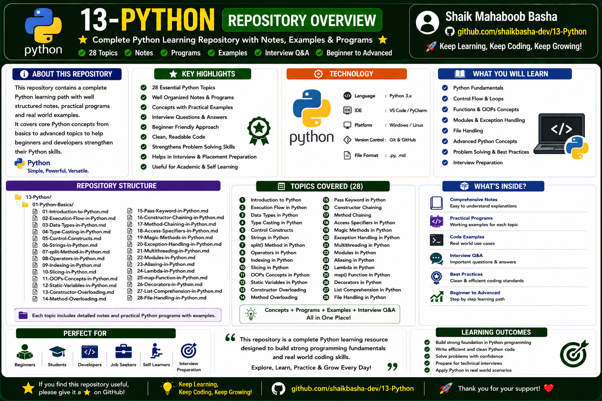

<div align="center">

# Python

### A Comprehensive Python Learning Repository for Beginners, Students, and Developers



<br>


</div>

---

# Repository Overview

This repository is a structured and comprehensive Python learning resource designed to help learners build a strong foundation in Python programming. It covers everything from basic syntax and data types to advanced concepts such as Object-Oriented Programming, Exception Handling, Functional Programming, Multithreading, Modules, Packages, File Handling, and numerous hands-on programs.

The repository is organized into dedicated folders, allowing learners to study one concept at a time through well-structured explanations, examples, and practical programs.

Whether you are learning Python for the first time, revising important concepts, preparing for technical interviews, or strengthening your programming skills, this repository provides a clear and systematic learning path.

---

# About

This repository has been created with the goal of making Python learning simple, structured, and practical.

It contains concept-wise folders that explain Python fundamentals as well as a dedicated collection of **154 beginner-friendly Python programs** for practice and revision. Every topic is organized logically so learners can progress from basic programming concepts to advanced Python features without confusion.

The content is designed to emphasize readability, practical understanding, and real-world programming practices, making it suitable for self-learning, academic study, coding practice, and interview preparation.

---

# Learning Objectives

This repository is designed to help learners:

- Understand Python programming from fundamentals to advanced concepts.
- Learn Python syntax through structured examples.
- Build a strong foundation in Core Python.
- Understand Object-Oriented Programming (OOP) concepts in Python.
- Practice Exception Handling and error management.
- Learn Functional Programming concepts such as Lambda Functions, Map Functions, Decorators, and List Comprehensions.
- Understand Modules, Packages, and code organization.
- Learn File Handling for reading and writing files.
- Explore Multithreading concepts.
- Improve logical thinking and problem-solving skills.
- Prepare for coding interviews and technical assessments.
- Revise Python concepts efficiently using practical examples and standalone programs.

---

# Repository Structure

```text
Python
│
├── 01-Python-Basic-Introduction
├── 02-All-Data-Types-in-Python
├── 03-Type-Casting-in-Python
├── 04-Control-Statements-In-Python
├── 05-Operators-In-Python
├── 06-OOPs-In-Python
├── 07-Exception-Handling-In-Python
├── 08-Multithreading-In-Python
├── 09-Modules-and-Packages-In-Python
├── 10-Functional-Programming-In-Python
├── 11-File-Handling-In-Python
├── 12-Python-Programs
│
├── Python-Repository-Overview.png
└── README.md
```

---

# Repository Organization

| Folder | Description |
|----------|-------------|
| **01-Python-Basic-Introduction** | Covers the fundamentals of Python, including its introduction, features, execution model, and basic programming concepts. |
| **02-All-Data-Types-in-Python** | Explains Python's built-in data types with examples, usage, and practical demonstrations. |
| **03-Type-Casting-in-Python** | Demonstrates implicit and explicit type conversion between different Python data types. |
| **04-Control-Statements-In-Python** | Covers decision-making statements, loops, branching, and flow control in Python. |
| **05-Operators-In-Python** | Explains arithmetic, assignment, comparison, logical, identity, membership, and bitwise operators. |
| **06-OOPs-In-Python** | Provides complete coverage of Object-Oriented Programming concepts including classes, objects, constructors, inheritance, polymorphism, abstraction, encapsulation, and access specifiers. |
| **07-Exception-Handling-In-Python** | Demonstrates exception handling techniques, custom exceptions, exception hierarchy, and error management. |
| **08-Multithreading-In-Python** | Covers thread creation, thread lifecycle, synchronization, and multithreading concepts. |
| **09-Modules-and-Packages-In-Python** | Explains built-in modules, user-defined modules, packages, importing techniques, and code organization. |
| **10-Functional-Programming-In-Python** | Covers lambda functions, map(), decorators, list comprehensions, and other functional programming concepts. |
| **11-File-Handling-In-Python** | Demonstrates file creation, reading, writing, updating, and managing files using Python. |
| **12-Python-Programs** | Contains a collection of **154 beginner-friendly standalone Python programs** for learning, revision, practice, and interview preparation. |

---

# Topics Covered

This repository provides structured learning for the following Python topics:

## Python Fundamentals

- Introduction to Python
- Features of Python
- Python Syntax
- Variables
- Comments
- User Input
- Basic Programs

---

## Data Types

- Integer
- Float
- Boolean
- String
- Complex
- Type Identification

---

## Type Casting

- Implicit Type Casting
- Explicit Type Casting
- Conversion Between Data Types
- Type Conversion Examples

---

## Control Statements

- if Statement
- if-else Statement
- if-elif-else Statement
- match-case Statement
- for Loop
- while Loop
- break Statement
- continue Statement
- range() Function

---

## Operators

- Arithmetic Operators
- Assignment Operators
- Comparison Operators
- Logical Operators
- Identity Operators
- Membership Operators
- Bitwise Operators

---

## Object-Oriented Programming (OOP)

- Classes and Objects
- Constructors
- Static Variables
- Constructor Overloading
- Method Overloading
- Encapsulation
- Inheritance
- Constructor Chaining
- Method Chaining
- Polymorphism
- Duck Typing
- Abstraction
- Access Specifiers
- Magic (Dunder) Methods

---

## Exception Handling

- Exception Handling
- try
- except
- finally
- User-Defined Exceptions
- Exception Handler Classes
- Multiple Exception Blocks

---

## Multithreading

- Thread Creation
- Thread Lifecycle
- Thread Synchronization
- Multithreading Concepts

---

## Modules and Packages

- Modules
- Packages
- Import Statements
- Aliasing
- User-Defined Modules

---

## Functional Programming

- Lambda Functions
- Map Function
- Decorators
- List Comprehension
- List Slicing

---

## File Handling

- File Creation
- Reading Files
- Writing Files
- Updating Files
- File Operations

---

## Practice Programs

- 154 Beginner-Friendly Python Programs
- Concept-wise Examples
- Logical Programming
- Interview-Oriented Programs
- Revision Programs

---

# Repository Highlights

- Comprehensive Python learning repository
- Well-structured folder organization
- Beginner-friendly explanations
- Practical examples for every concept
- Step-by-step learning approach
- Covers Core Python fundamentals
- Object-Oriented Programming examples
- Exception Handling demonstrations
- Functional Programming concepts
- File Handling examples
- Multithreading concepts
- More than **154 standalone Python programs**
- Interview preparation friendly
- Revision-friendly content
- Clean and well-commented source code
- Suitable for self-learning and academic study

---

# Prerequisites

Before exploring this repository, you should have:

- Basic computer knowledge
- Python 3.x installed on your system
- Visual Studio Code, PyCharm, or any Python IDE
- Basic understanding of programming concepts (recommended but not mandatory)

---

# How to Use This Repository

Follow these steps to make the best use of this repository:

### Step 1

Clone the repository.

```bash
git clone <repository-url>
```

### Step 2

Open the repository in your preferred Python IDE.

Examples:

- Visual Studio Code
- PyCharm
- IDLE

### Step 3

Follow the folders in numerical order.

```text
01 → 02 → 03 → ... → 12
```

Each folder builds upon concepts learned in the previous folder.

### Step 4

Study the explanations and source code carefully.

### Step 5

Run the Python programs to understand their output and behavior.

```bash
python filename.py
```

### Step 6

Practice by modifying the programs and experimenting with different inputs.

### Step 7

Complete the **12-Python-Programs** folder to strengthen your coding skills and prepare for interviews.

---

# Repository Statistics

| Category | Details |
|----------|---------|
| **Programming Language** | Python |
| **Difficulty Level** | Beginner to Advanced |
| **Learning Approach** | Concept-Based |
| **Repository Structure** | 12 Organized Learning Modules |
| **Practice Programs** | 154 Standalone Python Programs |
| **Code Style** | Beginner-Friendly and Well Commented |
| **Examples Included** | Yes |
| **Interview Preparation** | Yes |
| **Revision Friendly** | Yes |
| **Hands-on Practice** | Yes |

---

# Who Can Use This Repository?

This repository is suitable for:

- Beginners learning Python for the first time
- School and College Students
- Self-Learners
- Python Enthusiasts
- Software Engineering Students
- Coding Bootcamp Learners
- Technical Interview Candidates
- Competitive Programming Beginners
- Anyone looking to revise Core Python concepts

---

# Recommended Learning Path

For the best learning experience, follow the folders in the order below:

```text
01. Python Basic Introduction
            ↓
02. All Data Types in Python
            ↓
03. Type Casting in Python
            ↓
04. Control Statements in Python
            ↓
05. Operators in Python
            ↓
06. OOPs in Python
            ↓
07. Exception Handling in Python
            ↓
08. Multithreading in Python
            ↓
09. Modules and Packages in Python
            ↓
10. Functional Programming in Python
            ↓
11. File Handling in Python
            ↓
12. Python Programs
```

Following this sequence ensures that each concept builds naturally on the previous one, helping you develop a strong understanding of Python programming.

---

# Repository Benefits

By completing this repository, you will be able to:

- Build a strong foundation in Python programming.
- Understand Python syntax and programming concepts with confidence.
- Write clean, readable, and maintainable Python code.
- Apply Object-Oriented Programming principles effectively.
- Handle exceptions and errors gracefully.
- Work with modules, packages, and file operations.
- Understand functional programming techniques.
- Practice Python through 154 hands-on programs.
- Strengthen logical thinking and problem-solving skills.
- Prepare effectively for coding interviews and technical assessments.

---

# Support

If this repository helps you in your learning journey, interview preparation, or future reference, please consider giving it a **Star ⭐**.

Your support is greatly appreciated and motivates me to continue creating high-quality educational repositories.

---

# Conclusion

This repository provides a structured, practical, and comprehensive approach to learning Python from the fundamentals to advanced programming concepts. Organized into **12 dedicated learning modules** and supported by **154 standalone practice programs**, it enables learners to develop a solid understanding of Python through concept-based explanations and hands-on coding experience.

Whether your goal is academic learning, skill development, interview preparation, or revision, this repository serves as a reliable reference to strengthen your Python programming knowledge and problem-solving abilities.

**Happy Learning and Keep Coding!**
